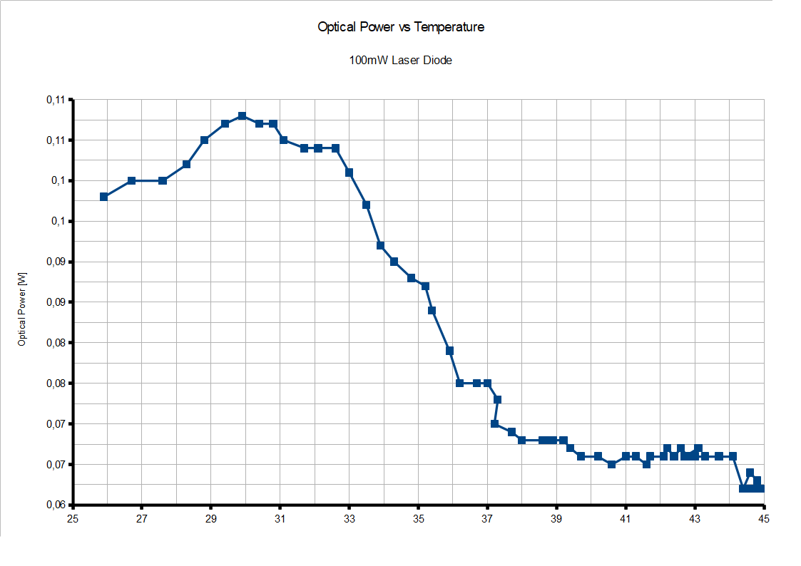
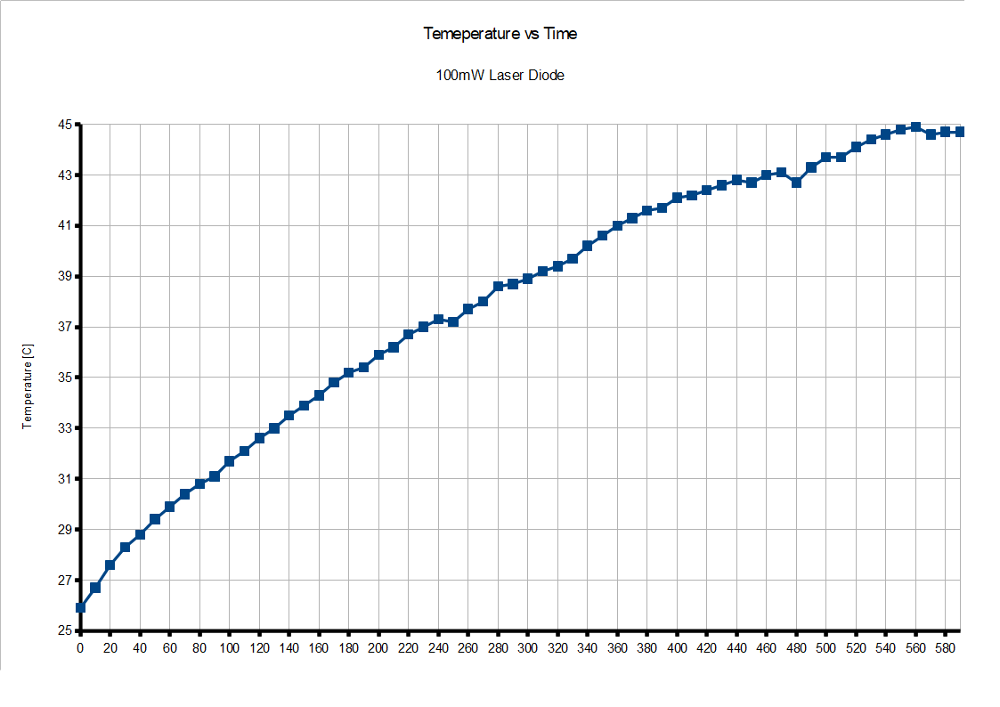
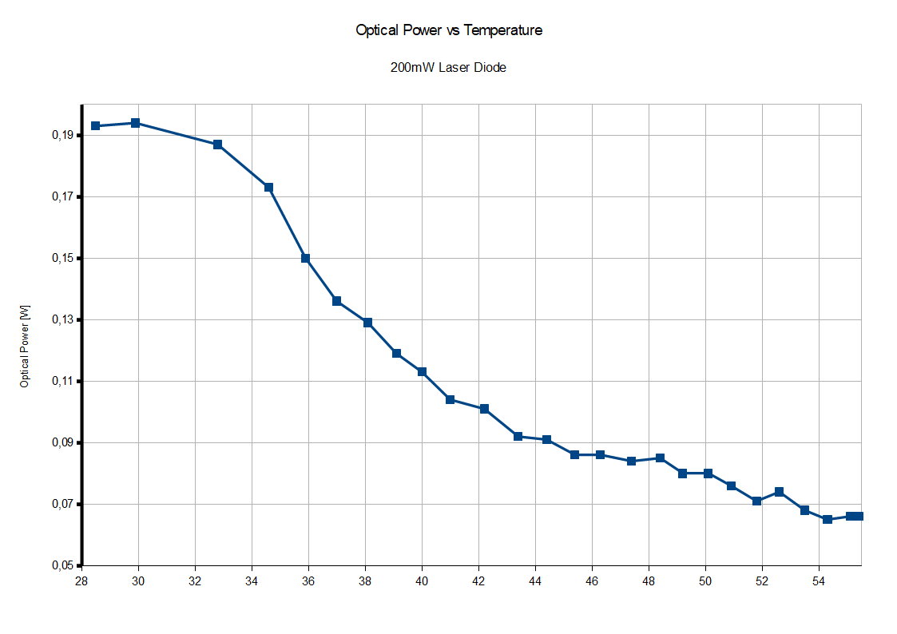
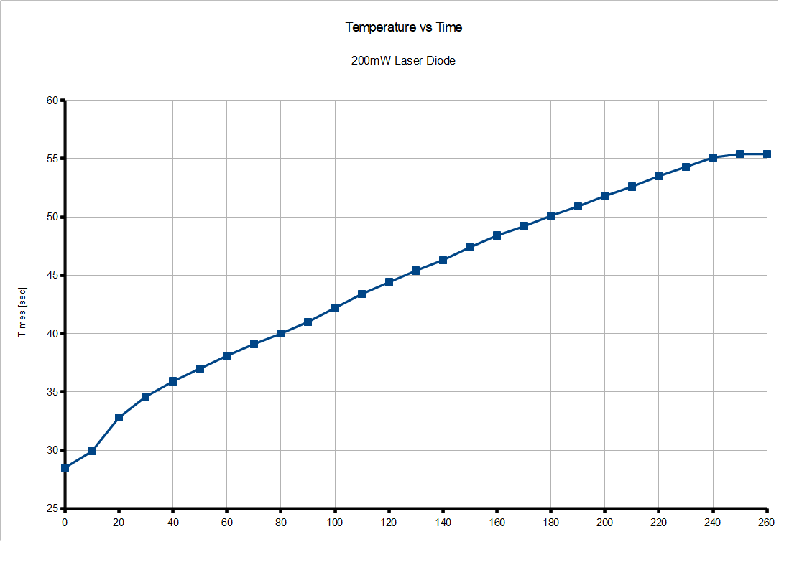

## Introduction
For many of my projects, I use laser diodes available on Chinese auction sites with manufacturer-rated optical powers of 100 mW and 200 mW. Unfortunately,
these diodes lack datasheets. I decided to measure their parameters—specifically forward voltage, current, and both electrical and optical power at a relatively constant temperature—as,
well as the effect of temperature on optical power and the temperature profile over time at maximum power.
## Diode parameters

The descriptions for both the 100mW and 200mW versions are very sparse:
Green laser with a wavelength of 532nm
Dimensions: 12×35mm
Dot-shaped output – the beam forms a dot, allowing for precise point marking on stage. Ideal for lighting effects and visual presentations.
Dimensions:

The dimensions for the 100mW and 200mW versions are identical.

## Temperature measurement
I set the output power to 100 mW and 200 mW, respectively, using a potentiometer connected to the CN5711 driver, and then measured the time, 
temperature, and optical power of the given diode. The test setup is shown below.

## Results
Full results can be found in the attached odt file. Charts below:
## 100mW Version

## 200mW Version

## Results description

It is evident that the optical output power depends heavily on temperature. A 10-degree rise causes a power drop of nearly 50%. Since both diode versions share the same housing, this issue is particularly pronounced in the 200 mW version, where a 50% power drop occurred after just 80 seconds of continuous operation, compared to 240 seconds for the 100 mW version (although the latter experienced a 40% drop). This highlights the need for temperature stabilization. Consequently, for subsequent measurements, I used an additional fan to maintain a relatively constant temperature of 25°C.
